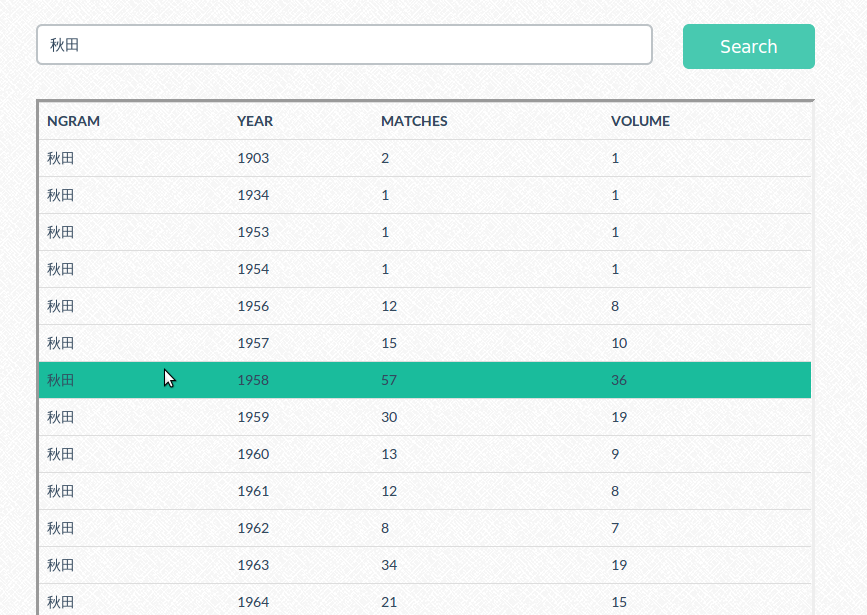

A local implemtation of google ngrams 
=======

this repo is a local implementation of [google ngrams](https://books.google.com/ngrams) 
Different with google ngrams viewer, it shows the corresponding raw data in a table.  
 

## set up procedure 

- download.py  
	from google ngram viewer website, you can find the link of the raw data, but there are thousands zipped files to download, this script is used to do the dirty work. put all downloaded links in sourURL directory, and execute the script to download them.
	
- loadDB.py  	
	I use mySQL as database to store the raw data, you can choose whatever database you feel comfortable with. Run the script to upload all the downloaded data to database. 
    1gram foder here is just a demo, you can put all your raw data in it.	
	
- frontend/index.php 
	This is the web interface, user enter a word, then it queries from database and shows whatever matches it. 

- result screenshot 
 	

